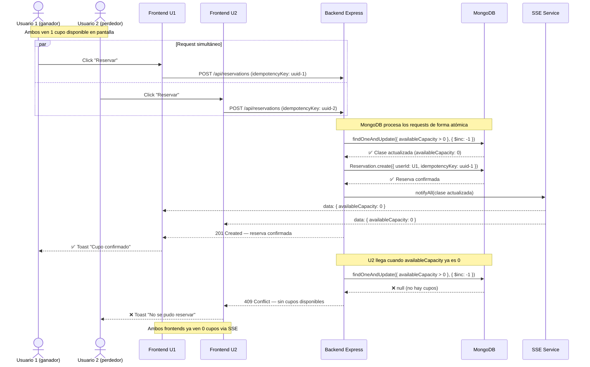

# Diagrama de secuencia — Reserva con concurrencia

## Flujo: dos usuarios intentan reservar el último cupo simultáneamente

## Notas

- **Atomicidad**: `findOneAndUpdate` con la condición `availableCapacity > 0` garantiza
  que solo un request puede decrementar el último cupo — MongoDB ejecuta la operación
  como una unidad atómica a nivel de documento.

- **Request perdedor**: recibe `409 Conflict` con mensaje claro. No se crea ninguna
  reserva ni se modifica el cupo.

- **Idempotencia**: si U1 reintenta con el mismo `idempotencyKey`, MongoDB rechaza
  la inserción por índice único — se hace rollback del cupo y se retorna error controlado.

- **Propagación en tiempo real**: el `SSE Service` notifica a todos los clientes
  conectados inmediatamente después de confirmar la reserva, sin que necesiten recargar.